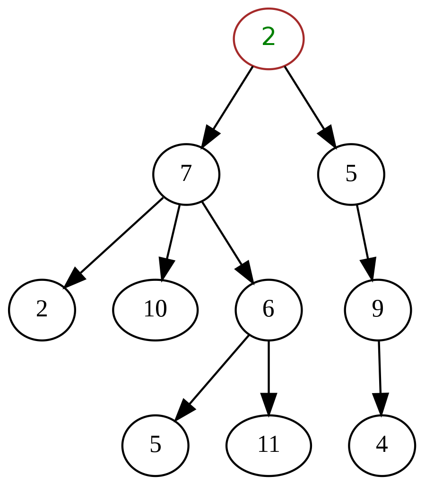
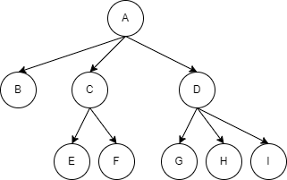
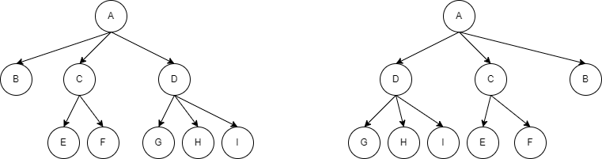
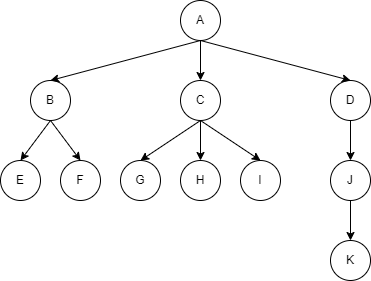
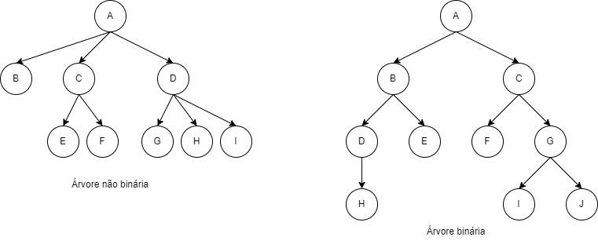
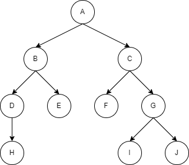

# Aula 09

## Filas

Uma `fila` é uma estrutura de dados que implementa a estratégia `FIFO` (_first-in-first-out_), ou seja, o primeiro a 
entrar é o primeiro a sair. Em outras palavras, seu funcionamento é exatamente como deve ser uma fila normal.

Operações comuns para uma estrutura de dados `fila` são:

* Inserir novo elemento.
* Remover elemento.
* Verificar se a fila está vazia.
 
Algumas das aplicações mais comuns na programação:

* Agendamento da CPU para organizar os processos que serão executados.
* Gerenciamento de tráfego online.
* Impressão de arquivos.
* Gerenciamento de pacotes de rede nos roteadores.

No [Java Collections Framework](https://docs.oracle.com/en/java/javase/17/docs/api/java.base/java/util/package-summary.html#CollectionsFramework),
a `interface` da fila (`Queue`) é implementada através das `classes` `PriorityQueue` e `LinkedList`, sendo esta 
última a mais comum de ser utilizada.

## Pilhas

Uma `Pilha` é uma estrutura de dados que implementa a estratégia `LIFO` (_last-in-first-out_), ou seja, o último a 
entrar é o primeiro a sair. Em outras palavras, seu funcionamento é o mesmo de quando empilhamos objetos.

As operações mais comuns são:

* _Push_ (o equivalente a inserir um novo elemento).
* _Pop_ (o equivalente a remover um elemento).
* _Peek_ ou _top_ (visualizar o elemento que está no topo da pilha).

Algumas das aplicações mais comuns em programação:

* Pilha de chamada de funções
  * Quando uma função é invocada, seu contexto de execução é inserido em uma pilha, incluindo variáveis locais e 
    endereços para retorno. Quando a execução da função termina, ela é retirada da pilha, permitindo ao programa 
    retornar à execução de onde estava antes.
* Funcionalidades de _desfazer_ (o famoso ctrl+z) e _refazer_. Aplicação semelhante nos browsers.
* Gerenciamento de memória (relacionado à pilha de chamada de funções).

Em `Java` existe uma classe legado chamada `Stack`, a qual implementa o conceito de `pilha`. Entretanto, de acordo 
com a documentação, é preferível utilizar a interface [Deque](https://docs.oracle.com/en/java/javase/17/docs/api/java.base/java/util/Deque.html).

De acordo com a documentção `Deque` significa _double ended queue_, ou seja, fila com duas saídas. Os métodos `push`,
`pop` e `peek` podem ser utilizados através dos equivalentes `addFirst`, `removeFirst` e `getFirst`. A `interface` 
`Deque` é implementada através de duas classes principais: `ArrayDeque` e `LinkedList`.

## Árvores

Uma `árvore` é uma `estrutura de dados` hierárquica que contém um conjunto de nós conectados. Quando desenhada, essa 
estrutura lembra uma árvore, daí o seu nome. Essa estrutura modela a hierarquia entre elementos.



Há uma variedade enorme de suas aplicações:

* Sistemas de arquivos
  * Estrutura de diretórios/pastas.
* DOM (_Document Object Model_) do `HTML` e `XML`.
* Processamento de linguagem natural
  * A forma como as frases são decompostas.
* Compiladores
  * A partir da decomposição de comandos.

### Terminologia e Propriedades

* Nó
  * Qualquer vértice de uma árvore.
* Nó raiz
  * É o vértice que está mais acima na hierarquia de uma árvore.
* Nó filho
  * É o vértice sucessor de outro vértice.
* Nó pai
  * É o vértice antecessor de outro vértice.
* Nó folha
  * Um vértice que não possui qualquer sucessor, ou filho. Também conhecido como nó terminal.
* [Nós] irmãos
  * Vértices sucessores de um mesmo vértice antecessor.
* Nó interno
  * Qualquer vértice que possua filho.
* Arco ou aresta
  * A conexão (direcionada ou não) entre dois nós.
* Caminho
  * Lista de vértices distintos e sucessivos, conectados por arcos de uma árvore.
  * Existe exatamanente um caminho entre o nó raiz e cada um dos demais nós da árvore.
    * Se houver mais de um caminho, ou nenhum, então temos na verdade um `grafo`.
* Grau de um vértice
  * É o número de subárvores não vazias de um nó.

  * Exemplo
    * Grau de A = 3
    * Grau de C = 2
* Qualquer nó é a raiz de uma subárvore consistindo dele e dos nós abaixo dele.



* A diferença entre duas árvores se dá pela ordem de suas subárvores.
  * Uma árvore ordenada é definida como uma árvore onde as subárvores formam um conjunto ordenado.
  * Em uma árvore ordenada define-se o primeiro, segundo e último irmão, de acordo com alguma propriedade.



* Os vértices estão classificados em `níveis`
  * O número de nós no caminho entre o vértice e a raiz.
  * Nível da raiz é 0.
  * Nível de um nó: nível do pai + 1.
* Altura de uma árvore
  * Corresponde ao maior nível
* Floresta
  * Conjunto de árvores.
  * Se removemos a raiz e os arcos que a ligam às subárvores, ficamos com uma floresta.

### Árvore Binária

Uma `árvore binária` é aquela cujo cada nó tem, **no máximo**, dois filhos.



Em uma `árvore binária` os nós filhos são ordenados como `filho da direita` e `filho da esquerda`.

Operações comuns em uma `árvore binária`:

* Visualizar(p): visualiza o conteúdo do nó apontado por _p_.
* Esquerda(p): leva o programa ao filho da esquerda de _p_.
* Direita(p): leva o programa ao filho da direita de _p_.
* Pai(p): leva o programa ao pai de _p_.
* Irmão(p): leva o programa ao irmão de _p_.
* isLeft(p): retorna `true` se _p_ é filho da esquerda.
* isRight(p): returna `true` se _p_ é filho da direita.
* Criar: cria uma `árvore binária` vazia ou contendo apenas o nó raiz.
* Criar Filho Esquerda(p,x): cria uma filho da esquerda para o nó _p_ e conteúdo _x_.
* Criar Filho Direita(p,x): cria uma filho da direita para o nó _p_ e conteúdo _x_.
* Remover(p): remove o nó _p_, reorganizando a árvore, se necessário.

#### Formas de se percorrer uma árvore binária



* Pré-ordem ou prefixo
  * Raiz -> Esquerda -> Direita
  * A -> B -> D -> H -> E -> C -> F -> G -> I -> J
* Em ordem ou infixo
  * Esquerda -> Raiz -> Direita
  * H -> D -> B -> E -> A -> F -> C -> I -> G -> J
* Pós-ordem ou posfixo
  * Esquerda -> Direita -> Raiz
  * H -> D -> E -> B -> F -> I -> J -> G -> C -> A

Para se percorrer, o método `visualizar(p)` pode ser usado de forma `recursiva`, ou seja, quando um método chama a 
ele mesmo. Ex.:

```java
preOrdem(No no){
    System.out.println(no);
    preOrdem(no.getEsquerda());
    preOrdem(no.getDireita());
}
        
emOrdem(No no){
    emOrdem(no.getEsquerda());
    System.out.println(no);
    emOrdem(no.getDireita());
}

posOrdem(No no){
    posOrdem(no.getEsquerda());
    posOrdem(no.getDireita());
    System.out.println(no);
}
```

#### Árvore binária de busca

Uma `árvore binária de busca ` (_binary search tree_) é uma árvore cujo preenchimento já a deixa ordenada. O 
algoritmo é simples. Após a criação da árvore com o nó raiz, a inserção de outro nó acontede da seguinte forma: Caso 
o novo valor seja menor do que o nó atual, ele deverá ser inserido na subárvore à esquerda. Caso contrário, ou seja, 
se o novo valor for maior, este será inserido na subárvore da direita.

Com a árvore criada dessa forma, a busca por valores acontece muito mais rápido, pois somente parte da árvore é 
percorrida.


## Exercícios

1. Crie uma `classe` chamada `Coordenador` e outra `classe` chamada `Aluno`. Na `classe` `Principal` crie uma 
   instância de `Coordenador` e cinco instâncias de `Aluno`. Faça com que todos os alunos sejam atendidos pelo 
   coordenador através da implementação de uma `fila`.
2. Crie uma `classe` chamada `Prova` e outra `classe` chamada `Professor`. Na `classe` `Principal` crie uma 
   instância de `Professor` e cinco instâncias de `Prova`. Faça com que o professor corrija as provas através da 
   implementação de uma pilha.
3. Crie uma `árvore binária de busca` e insira os seguintes valores: 10, 5, 8, 21, 32, 4, 9, 1, 3, 7, 0, 6. Depois 
   imprima os valores ao percorrer a árvore no modo pré-ordem, em-ordem e pós-ordem.